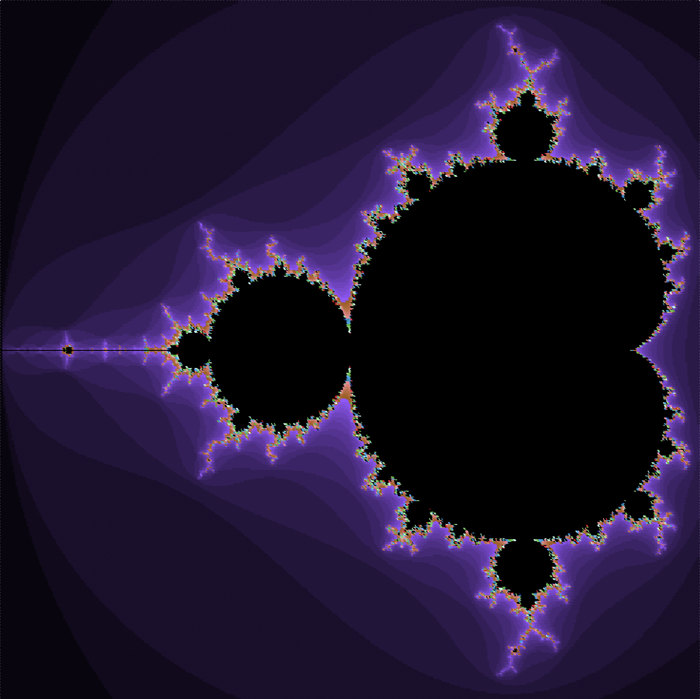
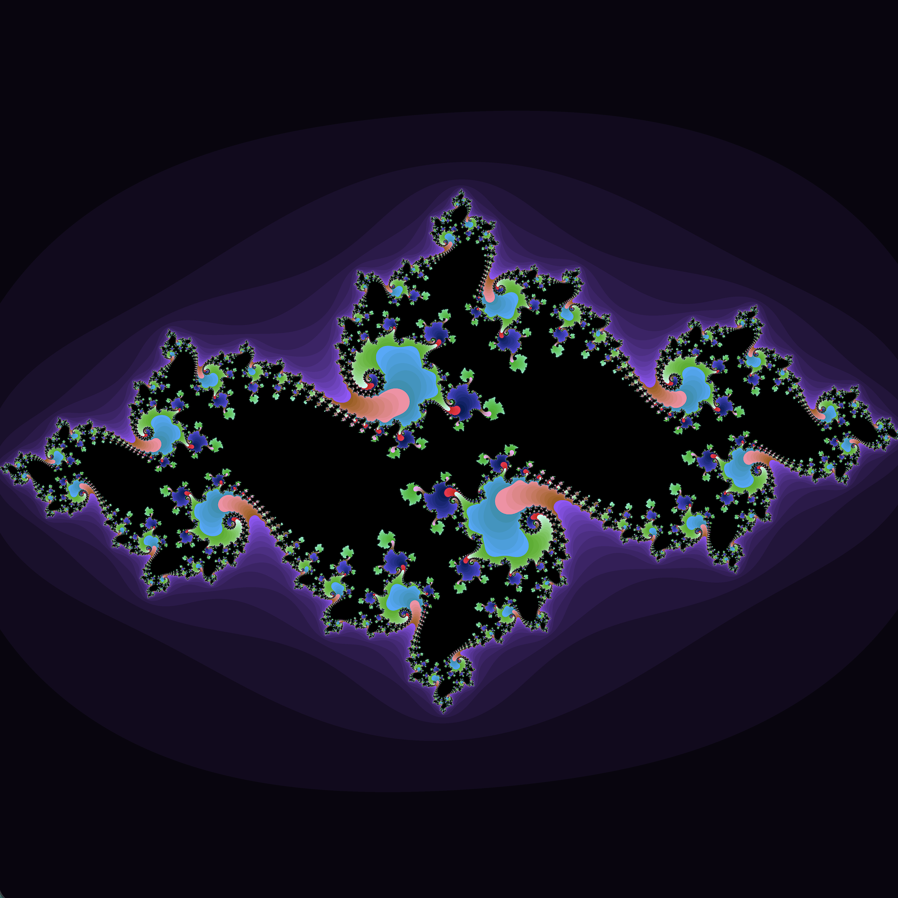
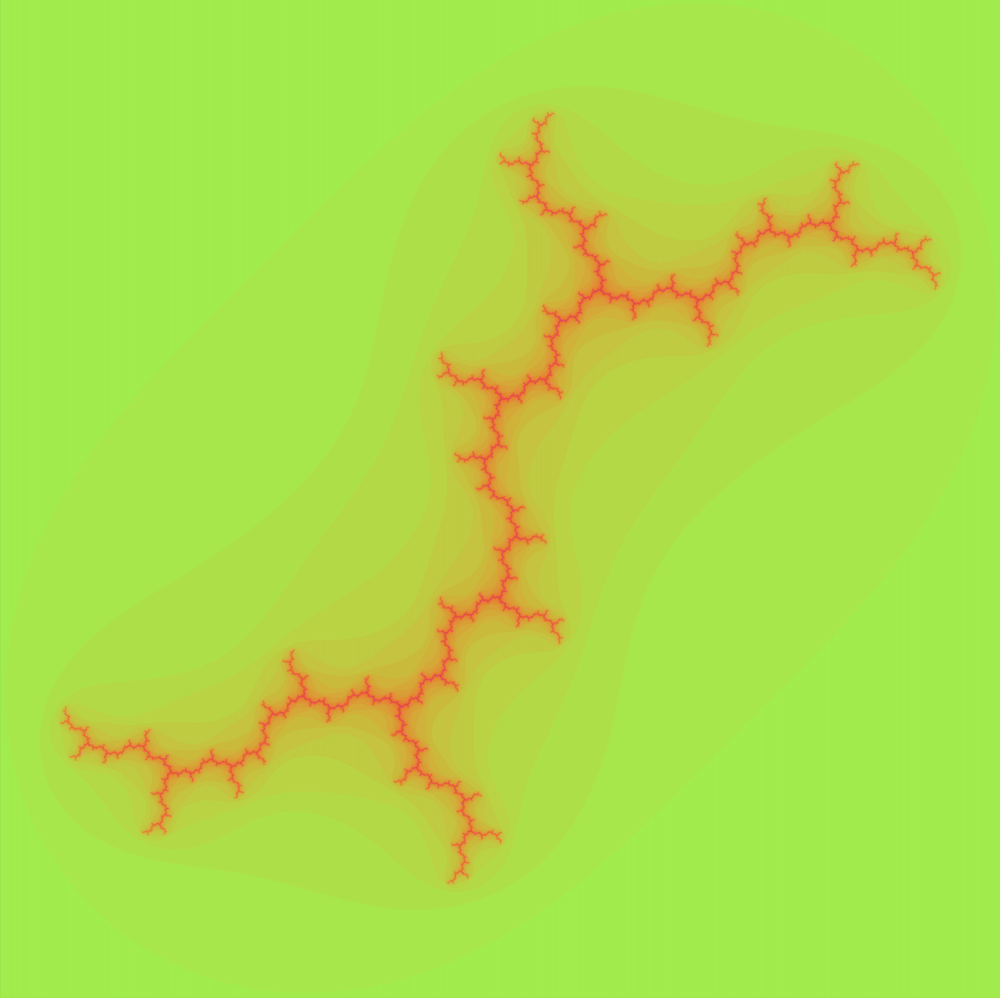
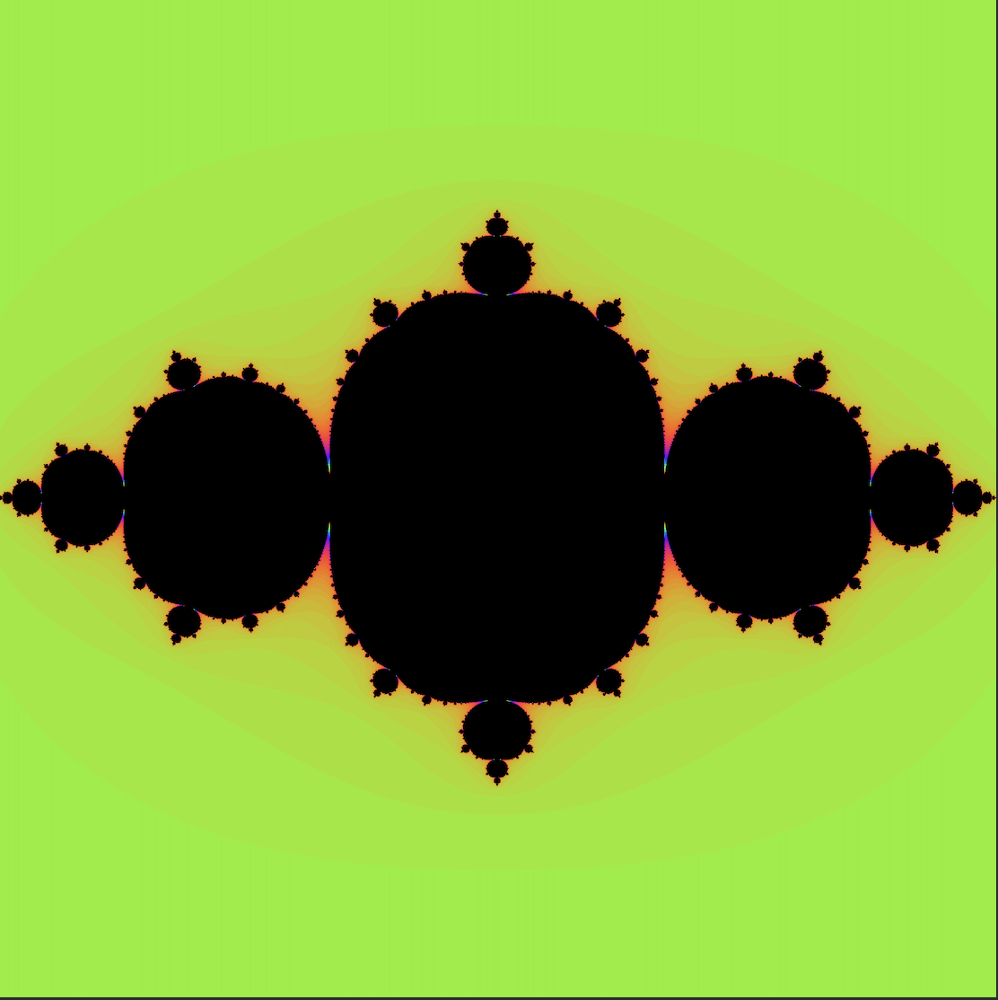
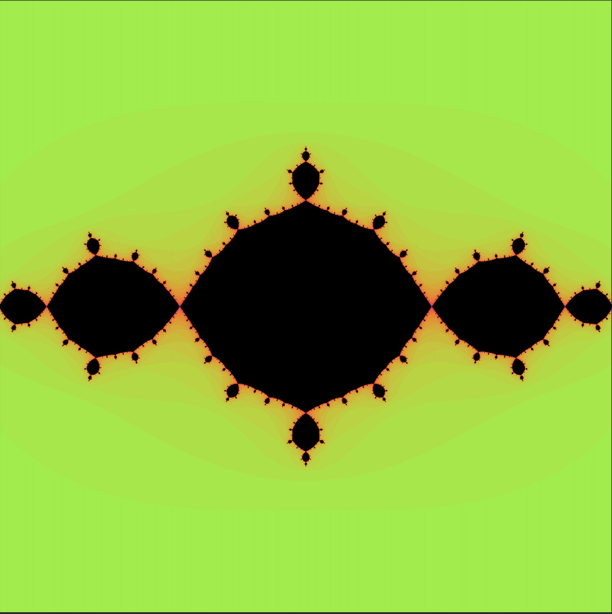
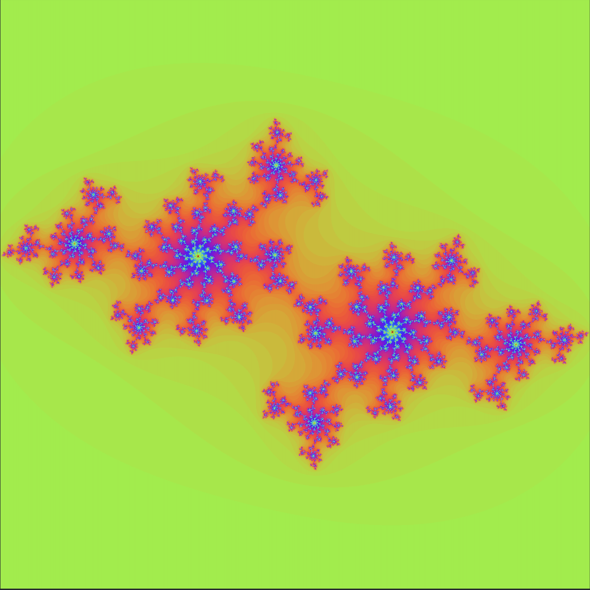

# Mandelbrot and Julia sets

These 2 fractals do not require recursion, they instead use the mathematical function f(z) =  z2 + c repeated.

## The Mandelbrot set 

 
The Mandelbrot set
 
This set is placed on the complex plane and tests all complex values for c in the f(z) =  z2 + c. There is somthing called the explosion, when c > 2, it begins climbing at a dizzying rate to infinity. The set does not include that which have exploded and only colors points that have not exploded yet.

You may have noticed the set is not all black, that is because the colors are added to show the number of iterations for a point to take before exploding, some points never explode so they are colored black.

## The Julia Set set 

 
The Julia set
 
This set is also placed on the complex plane but unlike the Mandelbrot set, c is constant, a fixed point on the Mandelbrot set. Instead, it positions z at every point for f(z) =  z2 + c The colors are still based on the explosion and there are different Julia sets, the one I showed you is spiral valley(-0.74434, 0.10772i) along with several other spiral valleys(-0.75, -1.1i), in between the blobs in the Mandelbrot set, it is one of the few that does really explode, here are some others:

 
dendrite Julia set(0, i)

 
San Marco Julia set(-0.75, 0i)

 
Bascilica Julia set(-1, 0i)

 
Grand Network Julia set(0.8 + 0.156i)
